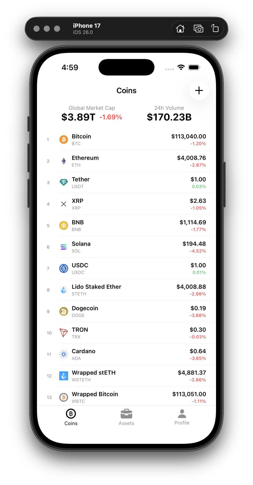
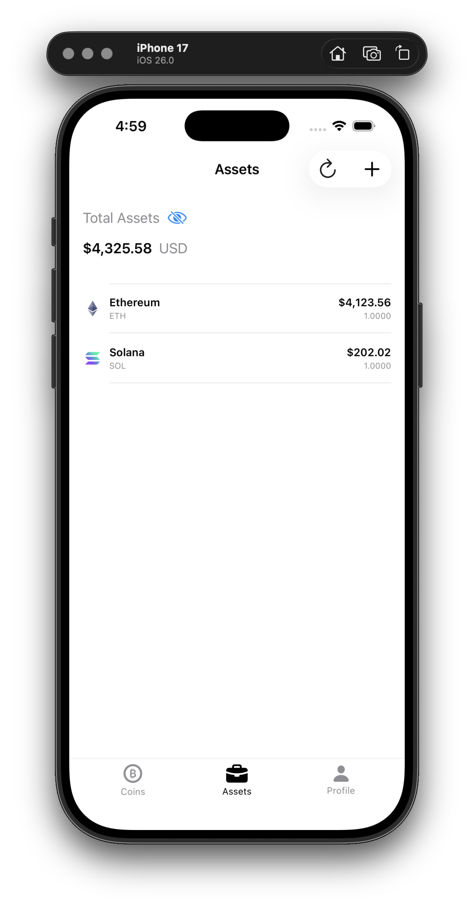
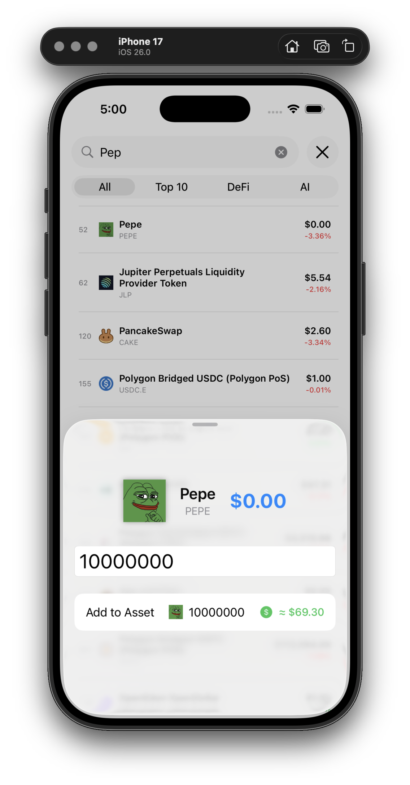

# 📱 Swift Crypto App

Educational iOS application for tracking cryptocurrencies and managing portfolio, demonstrating modern Swift development practices.


## 📸 Screenshots

| Market | Assets | Adding |
|--------------|------------|----------|
|  |  |  |

## ✨ Features

- 📊 **Market Monitoring** - view real-time cryptocurrency data
- 💼 **Portfolio Management** - track personal assets
- 📈 **Price Charts** - visualize historical data
- 🌍 **Global Statistics** - overall crypto market information
- 🔐 **Authentication** - secure login via Supabase
- 🔄 **Pagination** - efficient loading of large lists

## 🏗️ Architecture

The project is built using **MVVM** with **Repository Pattern** and feature-based modular organization:

```
CryptoAsyncAwait/
├── App/                    # Application entry point
├── Features/               # Feature modules
│   ├── Coin/              # Cryptocurrency operations
│   │   ├── Model/         # Data models
│   │   ├── View/          # SwiftUI views
│   │   ├── ViewModel/     # Business logic
│   │   └── Repository/    # Data layer
│   ├── Assets/            # Portfolio management
│   ├── Auth/              # Authentication
│   └── AddAssets/         # Add assets
├── Pages/                 # Main screens
│   ├── Market/            # Market page
│   └── Profile/           # User profile
└── core/                  # Shared components
    ├── Networking/        # Network layer
    ├── Extensions/        # Extensions
    └── DependencyContainer.swift
```

### Key Patterns

- **MVVM** - separation of UI and business logic
- **Repository Pattern** - data source abstraction
- **Protocol-Oriented** - flexibility and testability
- **Dependency Injection** - dependency management
- **Async/Await** - modern asynchronous operations

## 🛠️ Tech Stack

- **UI**: SwiftUI
- **Language**: Swift 5.9+ with async/await
- **Networking**: Alamofire + custom async wrapper
- **API**: CoinGecko API (v3)
- **Backend**: Supabase (Auth + Database)
- **Logging**: OSLog
- **Architecture**: MVVM + Repository Pattern

## 📦 Dependencies

Managed via Swift Package Manager:

- [Alamofire](https://github.com/Alamofire/Alamofire) - HTTP networking
- [Supabase Swift](https://github.com/supabase/supabase-swift) - Backend services

## 🚀 Installation & Setup

### Requirements

- Xcode 15.0+
- iOS 16.0+
- Swift 5.9+

### Installation Steps

1. **Clone the repository**
```bash
git clone https://github.com/teasec4/swift-crypto-app.git
cd swift-crypto-app
```

2. **Open project in Xcode**
```bash
open CryptoAsyncAwait.xcodeproj
```

3. **Configure Supabase** (optional for Auth)
   - Create a project at [supabase.com](https://supabase.com)
   - Add your credentials to `SupabaseService.swift`

4. **Run the project**
   - Select simulator or device
   - Press `Cmd + R`

## 🔑 API Integration

### CoinGecko API

The app uses the free CoinGecko API to fetch cryptocurrency data:

- **Markets** - list of top cryptocurrencies with pagination
- **Global** - global market statistics
- **Chart Data** - historical data for charts
- **Simple Prices** - current prices

> **Note**: API doesn't require a key for basic usage

## 📚 What You Can Learn

This project demonstrates:

✅ Modern Swift with async/await  
✅ Clean MVVM + Repository architecture  
✅ REST API integration  
✅ SwiftUI for building UI  
✅ Working with Supabase (Auth + DB)  
✅ Pagination and handling large lists  
✅ Custom networking layer with logging  
✅ Protocol-oriented approach  
✅ Error handling and loading states  
✅ Modular code organization  

## 🧪 Testing

The project includes `CryptoAsyncAwaitTests` folder for unit tests.

```bash
# Run tests
Cmd + U in Xcode
```

## 📝 Core Components

### Networking Layer

Custom network layer with support for:
- Generic async/await methods
- Automatic request/response logging
- Error handling via `CoinError`
- Alamofire integration

### Features

**Coin Feature**
- Cryptocurrency list with search
- Detailed coin information
- Price change charts
- Global market statistics

**Assets Feature**
- Portfolio management
- Add/remove assets
- Total value calculation

**Auth Feature**
- Registration and login
- Session management
- Supabase integration

## 🤝 Contributing

This is an educational project, but suggestions and improvements are welcome!

1. Fork the project
2. Create a feature branch (`git checkout -b feature/AmazingFeature`)
3. Commit your changes (`git commit -m 'Add some AmazingFeature'`)
4. Push to the branch (`git push origin feature/AmazingFeature`)
5. Open a Pull Request

## 📄 License

This project was created for educational purposes.

## 👤 Author

**teasec4**
- GitHub: [@teasec4](https://github.com/teasec4)

## 🙏 Acknowledgments

- [CoinGecko](https://www.coingecko.com/) for the free API
- [Supabase](https://supabase.com/) for backend-as-a-service
- Swift community for excellent libraries

---

⭐️ If this project was helpful for learning, give it a star!
